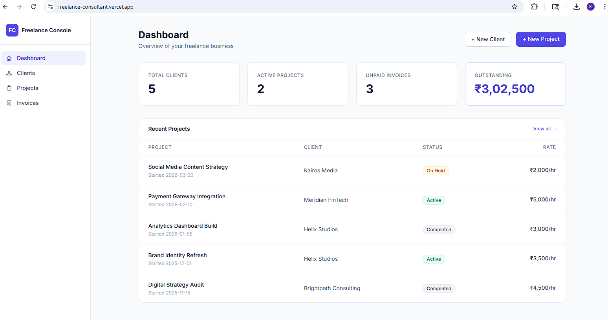
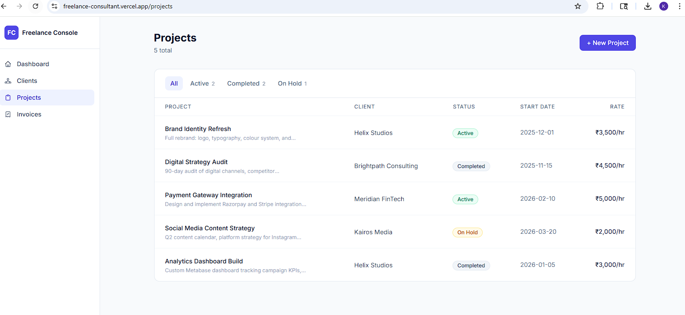
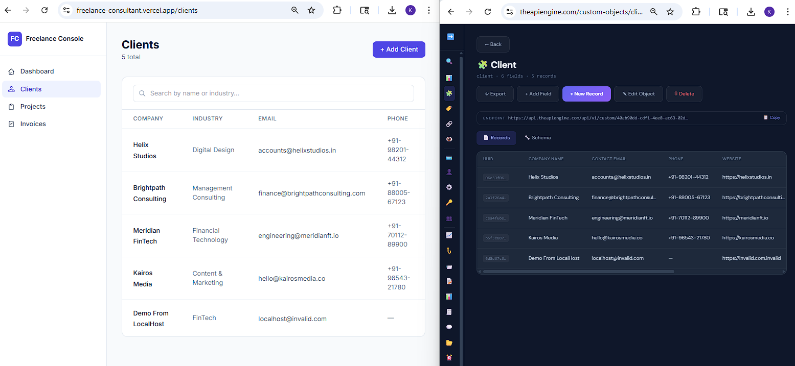
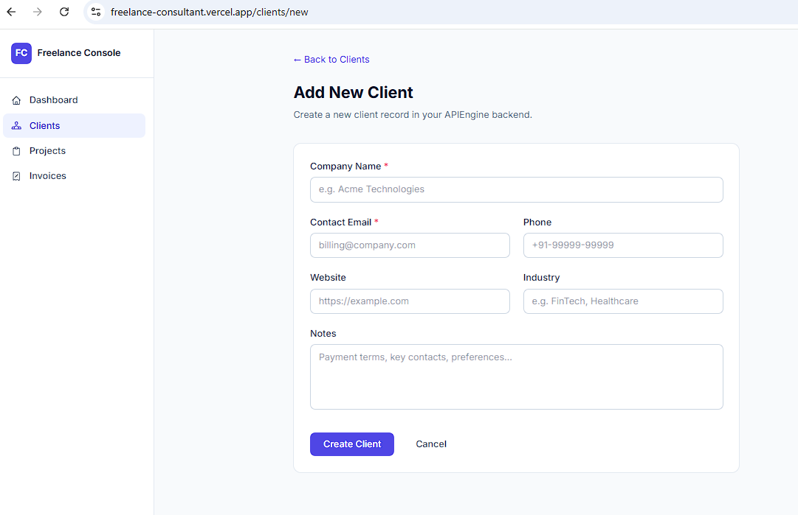

# Freelance Console

A working freelance consultant CRM, built end-to-end in 30 minutes 
with [APIEngine](https://theapiengine.com) and Claude Code. Track 
clients, projects, and invoices — without writing backend code.



## What this is

This is a real working frontend for a freelance consulting business. 
It's powered entirely by APIEngine — no Postgres, no Django, no 
backend setup. The data model (clients, projects, invoices) was 
created via API calls; the React app reads and writes through the 
same API.

**Total build time:** ~30 minutes.  
**Total backend code written by hand:** zero.

> **Note on the live demo:** [freelance-consultant.vercel.app](https://freelance-consultant.vercel.app/) 
> uses my own APIEngine API key, so records you add there are visible 
> to all visitors and persist in my account. To run it cleanly with 
> your own data, follow the Quickstart below.

## Features

- Dashboard with client/project/invoice summary cards
- Clients list with search, plus add/edit forms
- Projects list with status filter (Active / Completed / On Hold)
- Invoices list with paid/unpaid filtering
- Indian rupee formatting (₹3,02,500-style lakh separator)
- Skeleton loaders, empty states, real error handling
- Fully typed TypeScript against the OpenAPI spec
- React Query for caching and background refetches



## Quickstart

You'll need:
- Node 18+
- An APIEngine account (free tier is enough — [sign up](https://theapiengine.com))
- Your APIEngine API key

```bash
git clone https://github.com/kunal-kejriwal/apiengine-consultant-app-demo
cd apiengine-consultant-app-demo
npm install
cp .env.example .env.local
# Edit .env.local and paste your APIEngine API key
npm run dev
```

Open `http://localhost:5173`. You should see the dashboard.

## How it was built

This whole repo was generated end-to-end with Claude Code in three 
phases. The same backend powers both the frontend you're looking at 
and the APIEngine admin dashboard:



### Phase 1 — Schema design and creation (10 min)

I gave Claude Code my OpenAPI spec and asked it to design and 
create a data model for a freelance consulting business. It:

1. Read the spec to find the schema-management endpoints
2. Designed three custom objects (Client, Project, Invoice) with 
   relationships
3. Created them via `POST /api/v1/custom/models/` and 
   `POST /api/v1/custom/fields/` calls
4. Re-fetched the spec to confirm the new objects appeared

No dashboard work. No SQL. No migrations.

### Phase 2 — Realistic sample data (10 min)

Same LLM populated 4 clients, 5 projects, and 8 invoices via API. 
Real-sounding company names, internally consistent timelines, 
realistic Indian Rupee amounts. All persisted to the live backend 
with proper foreign keys.

### Phase 3 — Frontend generation (10 min)

Claude Code consumed the (now-updated) OpenAPI spec and produced 
this React app — typed API client, three pages, forms, status 
filtering, error handling. Calling the real APIEngine backend with 
no mocks.



## What APIEngine is

[APIEngine](https://theapiengine.com) is a backend-as-a-service that 
ships with a complete data model on day one — 19 pre-modeled CRM 
objects plus the ability to define your own. Every account gets a 
personalized OpenAPI spec that AI tools and code generators can 
consume directly.

The wedge: you don't write SQL, you don't manage migrations, you 
don't set up auth. You define your data, and a working API exists 
the moment you save.

## Replace it with your own data model

This app is opinionated toward freelance consulting. To adapt it 
for a different vertical:

1. Open your APIEngine dashboard
2. Create your own custom objects (Products, Recipes, whatever)
3. Re-download your spec
4. Hand the spec to Claude Code with a prompt like  
   *"Adapt this app to work with my new data model"*

The whole frontend is ~1,500 lines. It's meant to be read, modified, 
and replaced.

## Tech stack

- **Frontend:** React 18, TypeScript, Vite, Tailwind CSS v3, 
  React Router, TanStack Query
- **Backend:** APIEngine (Django/DRF/PostgreSQL/Redis under the hood)

## License

MIT — see [LICENSE](LICENSE). Use this however you like.

## Built by

[Kunal Kejriwal](https://kunalkejriwal.com) — also building APIEngine 
solo. Reach me on [LinkedIn](https://linkedin.com/in/kunalkejriwal).

## Questions

Open an issue here, or see [the docs](https://theapiengine.com/docs).